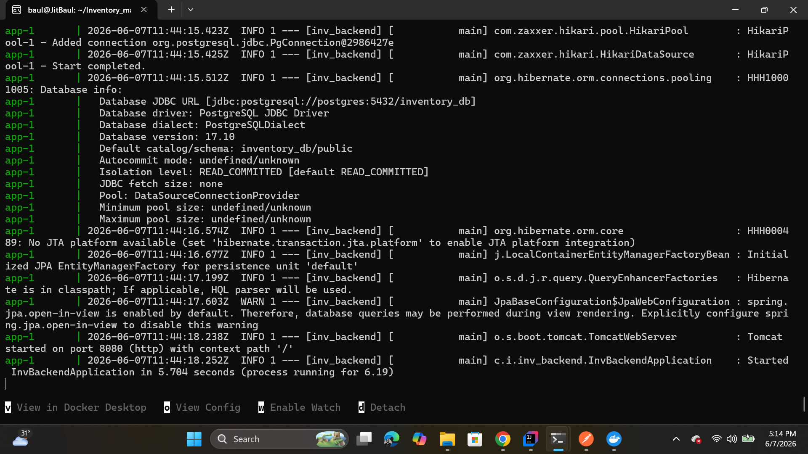
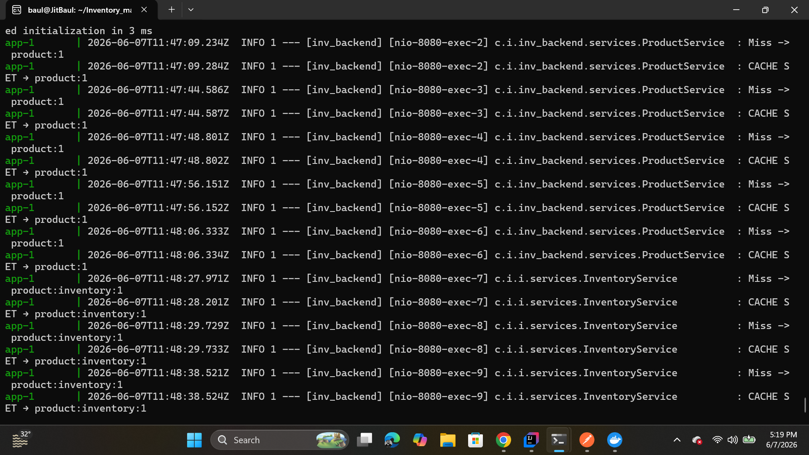
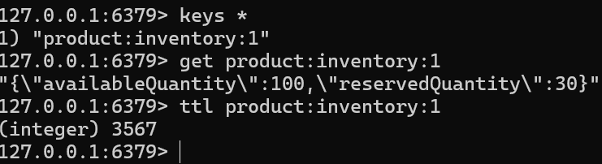
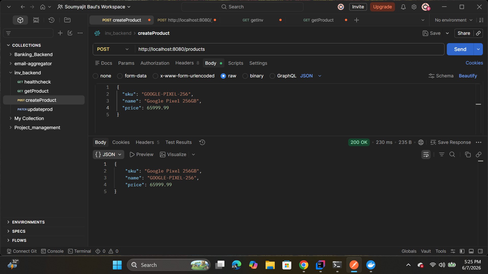

# Inventory Management Backend

Backend REST API for managing products and inventory using Spring Boot, PostgreSQL, Redis caching, reservation workflows, validation, exception handling, and Dockerized deployment.

---

## Features

### Product Management

* Create product
* Get product by ID
* Update product
* DTO validation
* Global exception handling
* Redis-backed product caching

### Inventory Management

* Create inventory for product
* Get inventory by product
* Reserve inventory
* Release inventory
* Inventory business validation

### Redis Caching

#### Product Cache

* Spring Cache abstraction
* `@Cacheable`
* `@CacheEvict`
* TTL based expiration

#### Inventory Cache

* Manual caching using `RedisTemplate`
* Cache-aside reads
* Write-through updates
* JSON serialization
* Versioned Redis keys

### Infrastructure

* PostgreSQL database
* Dockerized deployment
* Layered architecture
* DTO-driven API design

---

## Tech Stack

### Backend

* Java
* Spring Boot
* Spring Data JPA

### Database

* PostgreSQL

### Cache

* Redis
* RedisTemplate

### DevOps

* Docker
* Docker Compose

### Utilities

* Lombok
* Jakarta Validation

---

# Architecture

```text
Client
 ↓
Controller
 ↓
Service
 ↓
Redis Cache
 ↓ HIT
Return

OR

MISS
 ↓
PostgreSQL
 ↓
Populate Cache
 ↓
Response
```

---

# Screenshots

## Application Running

Example:

```text
docker compose up --build
```
Image:



---

## Redis Cache Logs

Example:

```text
CACHE MISS
CACHE SET

CACHE HIT

```

Image:



---

## Redis Keys

Example:

```text
KEYS *

v1:products:inventory:1
v2:products:inventory:1
```

Image:

```text
docs/screenshots/redis-keys.png
```

---

## Redis Stored Data

Example:

```text
GET v2:products:inventory:1
```

Image:



---

## API Testing

Include:

* GET inventory
* POST reserve
* POST release
* Response body

Image:



---

## Benchmark Results

| Scenario  | Avg Time |
| --------- | -------- |
| DB Read   | ~360 ms  |
| Redis HIT | ~13 ms   |

Approximate read improvement:

```text
~27× faster
```

---

# API Endpoints

## Product APIs

### Create Product

```http
POST /products
```

Request:

```json
{
  "sku": "ABC_101",
  "name": "Keyboard",
  "price": 1499.99
}
```

---

### Get Product

```http
GET /products/{pid}
```

Flow:

```text
Redis
↓ HIT
Return

OR

MISS
↓
Database
↓
Populate Cache
↓
Return
```

---

### Update Product

```http
PATCH /products/{pid}
```

Flow:

```text
Update DB
↓
Evict Cache
↓
Next GET rebuilds cache
```

---

## Inventory APIs

### Create Inventory

```http
POST /products/{pid}/inventory
```

Request:

```json
{
  "availableQuantity": 100,
  "reservedQuantity": 20
}
```

Validation:

```text
reservedQuantity <= availableQuantity
```

---

### Get Inventory

```http
GET /products/{pid}/inventory
```

Flow:

```text
Check Redis
↓ HIT
Return

OR

MISS
↓
Database
↓
Store Cache
↓
Return
```

Cache Key:

```text
v2:products:inventory:{pid}
```

---

### Reserve Inventory

```http
POST /products/{pid}/inventory/reserve
```

Flow:

```text
Read Inventory
↓
Validate Availability
↓
Update Database
↓
Update Redis
↓
Return
```

---

### Release Inventory

```http
POST /products/{pid}/inventory/release
```

Flow:

```text
Read Inventory
↓
Restore Inventory
↓
Update Database
↓
Update Redis
↓
Return
```

---

# Redis Design

## Key Versioning

Redis keys use version prefixes.

Example:

```text
v1:products:inventory:{pid}
v2:products:inventory:{pid}
```

Benefits:

* Avoid cache collisions
* Support cache schema evolution
* Enable safe migration
* Allow gradual rollout

---

## Read Strategy

Cache Aside Pattern

```text
GET
↓
Check Cache
↓
MISS
↓
DB
↓
SET Cache
↓
Return
```

---

## Write Strategy

Write Through Cache

```text
WRITE
↓
Update Database
↓
Update Redis
↓
Return
```

---

## Serialization

Keys:

```text
StringRedisSerializer
```

Values:

```text
GenericJacksonJsonRedisSerializer
```

Example:

```json
{
  "availableQuantity": 100,
  "reservedQuantity": 20
}
```

---

## TTL

Inventory cache uses expiration to automatically remove stale entries.

---

# Logging

Application logs include:

```text
CACHE HIT
CACHE MISS
CACHE SET
WRITE THROUGH UPDATE
```

View logs:

```bash
docker compose logs -f app
```

---

# Run Locally

Clone repository:

```bash
git clone https://github.com/Jitbaul13-maker/Inventory_managent_system.git
```

Start containers:

```bash
docker compose up --build
```

Application:

```text
http://localhost:8080
```

---

# Future Improvements

* Redis Hash based inventory updates
* JWT Authentication
* Role Based Access Control
* Monitoring and metrics
* CI/CD pipeline

---

# Learning Outcomes

Through this project:

* Built REST APIs using Spring Boot
* Implemented cache-aside strategy
* Implemented write-through caching
* Designed DTO driven architecture
* Configured Redis serialization
* Implemented cache versioning
* Containerized services with Docker
* Improved application performance
